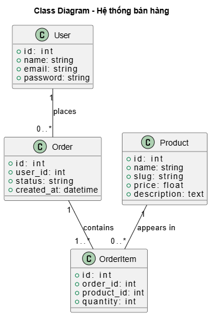

# DemoWeb - Laravel Project

## 👤 Thông tin sinh viên

- **Họ tên:** Phạm Anh Thái 
- **Mã sinh viên:** 23010784

---

## 📌 Giới thiệu Project

**DemoWeb** là một dự án web bán hàng đơn giản được xây dựng bằng Laravel.  
Ứng dụng hỗ trợ người dùng xem sản phẩm, đặt hàng, quản lý đơn hàng cá nhân và cho phép admin quản lý toàn bộ hệ thống.

---
✅ Chức năng của User (người dùng bình thường)
⚙️ Truy cập công khai (không cần đăng nhập):
GET /products: Xem danh sách sản phẩm.

GET /products/{product:slug}: Xem chi tiết sản phẩm.

🔐 Sau khi đăng nhập:
GET /dashboard: Chuyển hướng về trang danh sách sản phẩm.

GET /profile: Xem trang chỉnh sửa hồ sơ.

PATCH /profile: Cập nhật thông tin hồ sơ.

DELETE /profile: Xoá tài khoản.

📦 Đặt hàng:
GET /orders: Xem danh sách đơn hàng của mình.

POST /orders: Tạo đơn hàng mới.

GET /orders/{order}: Xem chi tiết đơn hàng.

👑 Chức năng của Admin (quản trị viên)
Tất cả các route admin đều dùng tiền tố /admin và cần có middleware auth + admin.

📊 Dashboard:
GET /admin: Truy cập trang dashboard chính của admin.

🛒 Quản lý sản phẩm:
CRUD tại /admin/products: tạo, xem, sửa, xoá sản phẩm.

🧩 Quản lý danh mục:
CRUD tại /admin/categories: quản lý các loại sản phẩm.

📦 Quản lý đơn hàng:
CRUD tại /admin/orders: xem và xử lý đơn hàng.

👥 Quản lý người dùng:
CRUD tại /admin/users: quản lý tài khoản người dùng.

🔐 Bảo mật (Security)
Dự án đã áp dụng một số biện pháp bảo mật cơ bản trong Laravel:

1. Xác thực (Authentication)
Sử dụng Laravel Breeze để cung cấp tính năng đăng ký, đăng nhập, xác thực email.

Mọi route yêu cầu người dùng phải đăng nhập đều được bảo vệ bởi middleware auth.

2. Phân quyền (Authorization)
Admin và User được phân biệt thông qua middleware admin.

Các route dành riêng cho quản trị viên (/admin) yêu cầu có quyền admin.

3. Bảo vệ CSRF
Laravel tự động thêm token CSRF vào các form để ngăn chặn tấn công Cross-Site Request Forgery.

4. Mã hóa mật khẩu
Mật khẩu người dùng được mã hóa bằng bcrypt thông qua Laravel Auth.

5. Validation dữ liệu đầu vào
Các request từ người dùng đều được xác thực bằng Form Request Validation để đảm bảo tính đúng đắn và an toàn.

6. Tối ưu hóa truy cập database
Sử dụng Eloquent ORM với kỹ thuật eager loading giúp tránh lỗi N+1 query.
## 🧱 Sơ đồ cấu trúc (Class Diagram)

